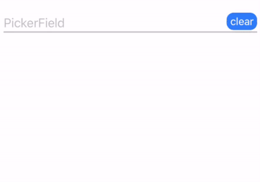
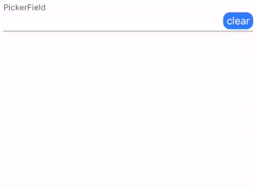

# MaterialFields [WIP]

A Material Guidelines UI driven text entry and value selection framework for better UI and modular validation layers.

---


|         | Main Features  |
----------|-----------------
💛 | Material UITextFields and UITextViews
💜 | Material UIPickerViews and UIDatePickers
💪 | Field wrapper class allowing for simple, modular validation
❌ | Error functionality to let your users know something was wrong with the input
👍 | Modular and customizable
😍 | Fully Swift
✅ | Easy to implement


### Adding MaterialFields To Your Project

---

Open your podfile and add MaterialFields under your target

```
target 'Your Project' do

  use_frameworks!
  
  pod 'MaterialFields'
  
end
```

Save then in your project directory run

``` pod install ```

## Getting Started

Getting started with MaterialFields is very easy! There are 2 example projects, one programmatic and one using storyboards showing you the implementation.

Essentially there are only 4 things you need to do to get the basic functionality going:

1. Instantiate the field
2. Set its placeholder (this is the title label) and data array (if PickerField)
3. Set its delegate
4. Implement the didEndEditing delegate method to get the value when the users done!

### [Field](https://barbulescualex.github.io/MaterialFields/Classes/Field.html)

---

First we define a Field. This is the wrapper class that all the fields conform to. This allows all of them to share implemenation and functionality and also leads to an easier validation layer

**2 Types Of Fields**

1. Text-entry fields. This comprises of [EntryField](https://barbulescualex.github.io/MaterialFields/Classes/EntryField.html) and [AreaField](https://barbulescualex.github.io/MaterialFields/Classes/AreaField.html).

2. Picker type fields. This comprises of [PickerField](https://barbulescualex.github.io/MaterialFields/Classes/PickerField.html) and [DateField](https://barbulescualex.github.io/MaterialFields/Classes/DateField.html)

They all look the exact same in their normal state but each offer their own unique functionality in different states. Picker type fields hold entry fields with pickers that drop down below them. They have done buttons to close themselves and optional clear buttons (set by `isClearable = true`).

**States**

A Field has **3 states**: 

* Not active : `isActive = false`
* Active, highlight visible : `isActive = true`
* Error : `hasError = true`

All the state logic and UI is handled internally. You can set the error state using [setError(withText:)](https://barbulescualex.github.io/MaterialFields/Classes/Field.html#/s:14MaterialFields5FieldC8setError8withTextySSSg_tF) and also remove it manually (the fields handle it on their own automatically, see specific field for details) using [removeErrorUI()](https://barbulescualex.github.io/MaterialFields/Classes/Field.html#/s:14MaterialFields5FieldC13removeErrorUIyyF)

**Values**

They return **2 types of values**:

* String accessed by `.text` if it is an EntryField, AreaField or PickerField and,
* Date accessed by `.date` if it is DateField

**Sizing**

Fields rely on their [intrinsicContentSize](https://developer.apple.com/documentation/uikit/uiview/1622600-intrinsiccontentsize). This is becuase they can change in height depending on if they open a picker or have text in their error state. The easiest way to implement them is by throwing them inside UIStackViews and letting auto-layout handle everything around them. It can be more work if you want to set a height constraint (through auto-layout or a frame) but below are the heights for each field and their given state.

| Field Type | Normal  | Error | Picker Open | Picker Open + Error |
----------|-----------------|----------|-----------|---------|
EntryField | 43.5 | 63.0 | N/A | N/A |
AreaField | 43.5+ | 63.0+ | N/A | N/A |
PickerField | 43.5 | 63.0 | 269.5 | 289 |
DateField | 43.5 | 63.0 | 269.5 | 289 |

**Colors**

Since all fields look the same they all have the exact same color properties (with small differences given the features).

### [EntryField](https://barbulescualex.github.io/MaterialFields/Classes/EntryField.html)

---


This is your UITextField. Most of the UITextField functionality has been forwarded to the EntryField.

**[EntryFieldDelegate](https://barbulescualex.github.io/MaterialFields/Protocols/EntryFieldDelegate.html)**

All of the UITextField delegates are here, just rebranded.

**Extra Features**

* Unit Label : set the `unit` property to a string to populate a unit label anchored on the right hand side.
* Money label : set `isMonetary = true` and a dollar sign is anchored to the left hand side.

Their colors are also overridable using `monetaryColor` or `unitColor`

**Responder Behaviour**

EntryFields behave the same way that UITextFields behave, `becomeFirstResponder()` will activate the field and `resignFirstResponder()` will deactivate the field.


### [AreaField](https://barbulescualex.github.io/MaterialFields/Classes/AreaField.html)

---


This is your UITextView with only the text-entry functionality, so a multiline EntryField. Unlike the EntryField this does not support `isMonetary` or `units`.

**[AreaFieldDelegate](https://barbulescualex.github.io/MaterialFields/Protocols/AreaFieldDelegate.html)**

All of the text-entry relevant delegates are here.

**Responder Behaviour**

AreaFields behave the same way that UITextViews behave, `becomeFirstResponder()` will activate the field and `resignFirstResponder()` will deactivate the field.


### [PickerField](https://barbulescualex.github.io/MaterialFields/Classes/PickerField.html)

---







This is your UIPickerView which only supports 1 column. Most of the setup work has been extracted away, leaving little implementation logic needed. All you need to do is set its `data` array to your string array and the rest is handled for you.
The PickerField holds an EntryField that is used to display the contents of the picker.

**[PickerFieldDelegate](https://barbulescualex.github.io/MaterialFields/Protocols/PickerFieldDelegate.html)**

This will be a little different than you're used to as you no longer need to implement the data source protocol.

You have:

* shouldBeginEditing : wether it should open or not

* didEndEditing: user closed the field by tapping on the done button

* cleared : user tapped the clear button (only if `isClearable = true`)

* selectedRowForIndexPath : user selected a different value in the picker


**Extra Features**

* `isManualEntryCapable` this appends a "Manual Entry" option to the end of your data source which brings up the keyboard if selected and activates the EntryField embedded inside the PickerField. The manual entry row label is overridable using `manualEntryOptionName`.

You can observe the current index using `indexSelected` set an index using `setIndexTo` and set the index to manual entry using `setIndexToManual()`.

**Responder Behaviour**

* `becomeFirstResponder()` will activate and open up the picker / EntryField if it's on manual entry
* `closeFirstResponder()` will deactivate and close the picker / EntryField if it's on manual entry


### [DateField](https://barbulescualex.github.io/MaterialFields/Classes/DateField.html)

---


This is your UIDatePicker. You can do all the things you can do with the UIDatePicker you're used to, the property names are the same.

**[DateFieldDelegate](https://barbulescualex.github.io/MaterialFields/Protocols/DateFieldDelegate.html)**

This mirrors the PickerField delegate.

You have:

* shouldBeginEditing : wether it should open or not

* didEndEditing: user closed the field by tapping on the done button

* cleared : user tapped the clear button (only if `isClearable = true`)

* dateChanged : user selected a different date

**Responder Behaviour**

* `becomeFirstResponder()` will activate and open up the picker
* `closeFirstResponder()` will deactivate and close the picker


## Validation Layers

Since all the fields conform to the Field class, validation layers tied directly to the Fields has never been easier!


Lets define 3 fields, an EntryField, an AreaField, and a PickerField

```
let entryField = EntryField()
let areaField = AreaField()
let pickerField = PickerField()
```

Lets also define a CaseIterable enum:

```
extension CaseIterable where AllCases.Element: Equatable {
    static func make(index: Int) -> Self { //get the key from the case index
        let a = Self.allCases
        return a[a.index(a.startIndex, offsetBy: index)]
    }
    
    func index() -> Int { //get the index from the case
        let a = Self.allCases
        return a.distance(from: a.startIndex, to: a.firstIndex(of: self)!)
    }
}

enum FieldKeys : String, CaseIterable {
  case entry
  case area
  case picker
}

```

With our CaseIterable enum we can use the validation keys as tags for the fields!

```
entryField.tag = FieldKeys.entry.index()
areaField.tag = FieldKeys.area.index()
pickerField.tag = FieldKeys.picker.index()

```

Lets say we need to validate a generic string before commiting changes to our Core Data model using an extension on NSManagedObject.

```
extension NSManagedObject {
  func validateString(view: Field, key: String?){
      var value = view.text as AnyObject?
       do {
            try self.validateValue(&(value), forKey: key)
       } catch {
            view.setError(errorText: "please try again")
            print(error)
            return
        }
        self.setValue(value, forKey: key)
  }
```

Now on any of the fields didEndEditing delegate methods we only need to 2 lines to validate our entry.

```
//EntryFieldDelegates
func entryFieldDidEndEditing(_ view: EntryField){
  let key = FieldKeys.make(index: view.tag) //the key reconstructed from our enum used for the field tags
  ourNSManagedObject.validateString(view,key)
}

//AreaFieldDelegates
func areaFieldDidEndEditing(_ view: AreaField){
  let key = FieldKeys.make(index: view.tag) //the key reconstructed from our enum used for the field tags
  ourNSManagedObject.validateString(view,key)
}

//PickerFieldDelegates
func pickerFieldDidEndEditing(_ view: PickerField){
  let key = FieldKeys.make(index: view.tag) //the key reconstructed from our enum used for the field tags
  ourNSManagedObject.validateString(view,key)
}
```

We now have tightly coupled our Fields (in a good way!) with our validation layer for both our data model and UI feedback!


## Docs

MaterialFields is fully documented [here](https://barbulescualex.github.io/MaterialFields/index.html) with Jazzy.

To regenerate the documentation run

`jazzy --source-directory 'MaterialFields/' --documentation=Guides/*.md`

in the project root directory


## License

MaterialFields is open under the MIT license.
